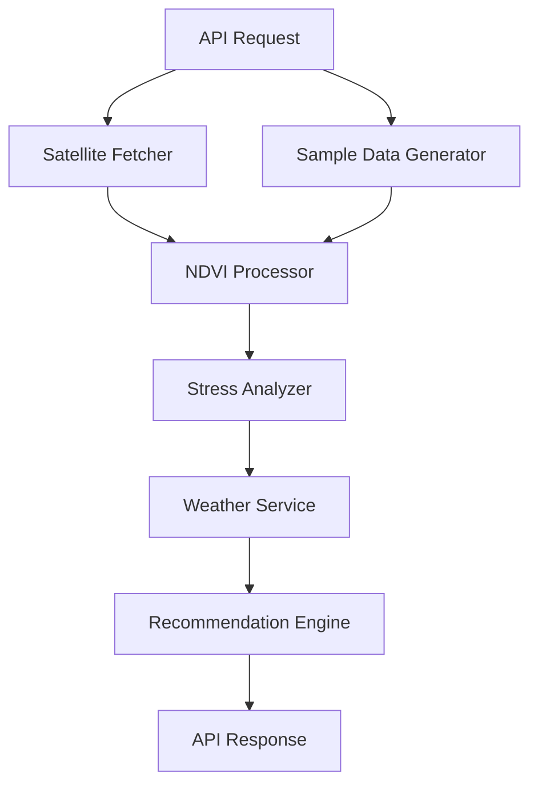
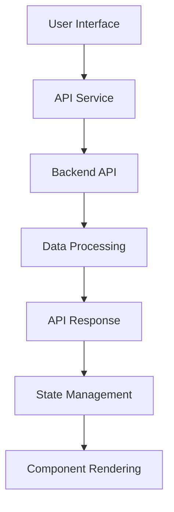

# System Architecture

## System Overview
AquaAdvisor is a web-based application that combines satellite imagery processing with machine learning to provide water stress detection and irrigation recommendations for agricultural fields. The system consists of a Python Flask backend for data processing and a React frontend for user interaction.

## Backend Architecture

### Components
1. **Flask Web Server**: Main application server handling API requests
2. **Satellite Data Fetcher**: Retrieves satellite imagery from Sentinel Hub
3. **NDVI Processor**: Calculates vegetation indices from satellite data
4. **Stress Analyzer**: Detects water stress zones using NDVI values
5. **Weather Service**: Integrates weather data from OpenWeatherMap
6. **Recommendation Engine**: Generates irrigation recommendations based on analysis
7. **Configuration Manager**: Handles application settings and credentials

### Data Flow

### Module Responsibilities

#### app.py
- Main Flask application
- API endpoint routing
- Request/response handling
- Integration of all components

#### config.py
- Environment variable management
- Configuration parameter storage
- Directory path setup

#### satellite_fetch.py
- Authentication with Sentinel Hub
- Satellite image search and retrieval
- Band data downloading and caching
- Sample data generation

#### ndvi_processor.py
- NDVI calculation from red and NIR bands
- Image smoothing and enhancement
- Statistical analysis of NDVI data
- Visualization generation

#### stress_analyzer.py
- Water stress zone classification
- Zone statistics calculation
- Quadrant analysis
- Stress map visualization

#### weather_service.py
- Weather data retrieval
- Rainfall estimation
- Evapotranspiration calculation
- Water deficit assessment

#### recommendation_engine.py
- Irrigation recommendation generation
- Priority and urgency assignment
- Water savings calculation
- Actionable advice formulation

#### utils.py
- Field area calculation
- Data validation
- Cache key generation
- Utility functions

## Frontend Architecture

### Components
1. **Landing Page**: Introduction and entry point
2. **Field Selector**: Interactive map for field boundary selection
3. **Analysis Loader**: Progress visualization during processing
4. **Results Dashboard**: Comprehensive analysis results display
5. **NDVI Visualization**: NDVI map rendering
6. **Stress Zone Map**: Water stress visualization
7. **Recommendation Cards**: Prioritized irrigation advice
8. **Water Efficiency**: Water savings metrics

### Data Flow

### Component Responsibilities

#### App.jsx
- Main application component
- Routing between pages
- Global state management

#### LandingPage.jsx
- Marketing and introduction
- Call-to-action buttons
- Feature highlights

#### FieldSelector.jsx
- Interactive map with drawing tools
- Field boundary selection
- Analysis initiation

#### AnalysisLoading.jsx
- Progress visualization
- Step-by-step feedback
- User engagement during processing

#### ResultsDashboard.jsx
- Central hub for all results
- Overview metrics display
- Component coordination

#### NDVIVisualization.jsx
- NDVI map rendering
- Image display optimization

#### StressZoneMap.jsx
- Stress zone visualization
- Color-coded zone display

#### RecommendationCards.jsx
- Recommendation presentation
- Priority-based sorting
- Urgency color coding

#### WaterEfficiency.jsx
- Water savings metrics
- Efficiency visualization
- Progress tracking

#### services/api.js
- API communication
- Request/response handling
- Error management

## Pipeline

### Full Analysis Pipeline
1. **Input Validation**: Verify field boundary coordinates
2. **Satellite Data Retrieval**: Fetch or generate satellite imagery
3. **NDVI Calculation**: Process red and NIR bands
4. **Image Enhancement**: Smooth and normalize NDVI data
5. **Statistical Analysis**: Calculate NDVI statistics
6. **Stress Detection**: Classify pixels into stress zones
7. **Weather Integration**: Retrieve and process weather data
8. **Recommendation Generation**: Create actionable advice
9. **Visualization Creation**: Generate maps and charts
10. **Response Formatting**: Package results for API response

### Quick Analysis Pipeline
1. **Input Validation**: Verify field boundary coordinates
2. **Sample Data Generation**: Create synthetic satellite data
3. **NDVI Calculation**: Process sample red and NIR bands
4. **Statistical Analysis**: Calculate NDVI statistics
5. **Stress Detection**: Classify pixels into stress zones
6. **Weather Integration**: Retrieve and process weather data
7. **Recommendation Generation**: Create limited advice
8. **Response Formatting**: Package results for API response

## Tech Choices

### Backend
- **Flask**: Lightweight, flexible web framework ideal for API development
- **SentinelSat**: Official library for Sentinel satellite data access
- **Rasterio**: Efficient geospatial raster data processing
- **NumPy**: High-performance numerical computing
- **SciPy**: Scientific computing and image processing
- **Matplotlib**: Data visualization and image generation
- **Requests**: HTTP library for API communication

### Frontend
- **React**: Component-based UI library for dynamic interfaces
- **Vite**: Fast build tool and development server
- **Tailwind CSS**: Utility-first CSS framework for rapid UI development
- **Leaflet**: Interactive mapping library
- **React Leaflet**: React components for Leaflet maps
- **React Leaflet Draw**: Drawing tools for Leaflet maps
- **Recharts**: Declarative charting library for React
- **Lucide React**: Icon library for React applications

### Why These Technologies?
1. **Flask**: Simple setup, minimal overhead, excellent for data science applications
2. **React**: Component reusability, efficient rendering, large ecosystem
3. **Vite**: Faster development experience compared to traditional build tools
4. **Tailwind CSS**: Rapid prototyping, consistent design system
5. **Leaflet**: Lightweight, customizable mapping solution
6. **Recharts**: Integration with React, good performance with large datasets

## Scalability

### Current Architecture
- Single-threaded Flask application
- In-memory data processing
- File-based caching

### Scaling Considerations
1. **Backend Scaling**:
   - Implement asynchronous task processing with Celery
   - Use Redis for caching and task queues
   - Deploy with Gunicorn for multi-process handling
   - Containerize with Docker for easy scaling

2. **Database Integration**:
   - Add PostgreSQL for persistent data storage
   - Implement user accounts and field management
   - Store historical analysis results

3. **Frontend Scaling**:
   - Implement code splitting for faster initial loads
   - Add service workers for offline functionality
   - Optimize images and assets

4. **Satellite Data Processing**:
   - Implement distributed processing with Dask
   - Use cloud storage for satellite imagery
   - Add preprocessing pipelines for faster analysis

### Load Balancing
- Use NGINX as a reverse proxy
- Implement round-robin load balancing
- Add health checks for service monitoring

## Security

### Data Protection
- Environment variables for API keys
- No storage of sensitive user data
- Secure communication with HTTPS (in production)

### API Security
- Input validation and sanitization
- Rate limiting to prevent abuse
- CORS configuration for frontend access

### Authentication
- Future implementation of user authentication
- JWT tokens for secure session management
- OAuth integration for third-party authentication

## Testing

### Backend Testing
- Unit tests for each module
- Integration tests for API endpoints
- Mock services for external APIs
- Performance testing for image processing

### Frontend Testing
- Unit tests for React components
- Integration tests for user flows
- End-to-end tests with Cypress
- Accessibility testing

### Continuous Integration
- Automated testing on code commits
- Code quality checks with linters
- Security scanning for dependencies
- Deployment automation

## Monitoring and Logging

### Backend Monitoring
- Application performance monitoring
- Error tracking and reporting
- Database query optimization
- Resource usage tracking

### Frontend Monitoring
- User experience monitoring
- JavaScript error tracking
- Performance metrics collection
- User behavior analytics

### Logging
- Structured logging for debugging
- Log aggregation for analysis
- Alerting for critical issues
- Audit trails for compliance